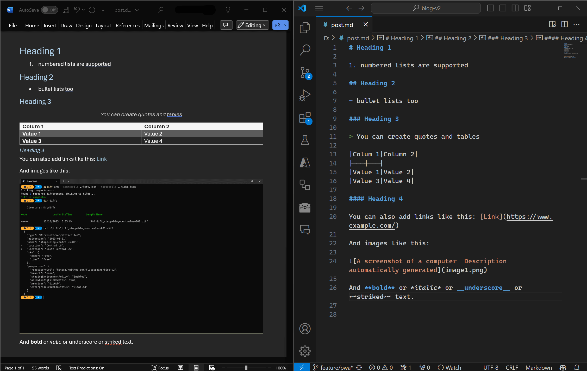

# documorph
`documorph` is a .NET package and command-line tool for converting between document file formats. The current implementation supports `.docx` to `.md`, `.wiki`, `.asciidoc` files. Additional output formats may be considred in the future.



## Package
```powershell
dotnet package install lpains.documorph --prerelease
```

### Getting Started
```csharp
// Create an instance of a processor class. Options are DocxToMarkdownProcessor, DocxToAsciiDocProcessor, or DocxToWikiProcessor.
// All processors require the .docx file path and a media relative path.
var processor = new DocxToMarkdownProcessor(source.FullName, ".");

// Invoke the Process() method which returns the markdown content and media files.
var (markdown, media) = processor.Process();
```

## CLI
```powershell
dotnet tool install --global lpains.documorph.cli --prerelease
```

### Getting Started
Upon installation, access the tool by executing `documorph` in your terminal. For specific command details, refer to the sections below or utilize the CLI help via `documorph -h`.

```powershell
documorph md --in <input> --out <output> [--media-location <directory path>] [-?, -h, --help]
documorph asciidoc --in <input> --out <output> [--media-location <directory path>] [-?, -h, --help]
documorph wiki --in <input> --out <output> [--media-location <directory path>] [-?, -h, --help]
```

Markdown usage example:
```powershell
documorph md --in .\source.docx --out .\target.md
```

Output file (target.md):
```markdown
# Heading 1

1. numbered lists are supported

## Heading 2

- bullet lists too

### Heading 3

> You can create quotes and tables

| Column 1 | Column 2 |
|----------|----------|
| value 1  | value 2  |

#### Heading 4
You can also add links like this: [Link](https://www.example.com)

And images like this:


And **bold** or *italic* or __underscore__ or ~~striked~~ text.
```

### Commands
#### md
Converts a .docx to [markdown](https://commonmark.org/help/).

#### asciidoc
Converts a .docx to [asciidoc](https://asciidoc.org/).

#### wiki
Converts a .docx to [MediaWiki](https://www.mediawiki.org/wiki/MediaWiki).

### Parameters
All commands take the same parameters.

#### `--in` (required)

The input `.docx` file or directory. If a folder is provided, all the `.docx` files will be converted. Any `.docx` file should be a valid Open XML Word document.

#### `--out` (required)

The output file or directory full path.

#### `--media-location`

The output directory full path to store the media files in. If this option is not provided, the media files are dropped in the folder where the output files are in.
